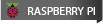

# Hello, I'm Wonkeun!

# I'm learning Computer Programming and Analysis at Seneca

### I love web development with JS stack, and C/C++ compiled language programming and algorithm. I still have a long journey to be a full stack programmer. I believe my strong passion will lead me to where I want to belong.

# Latest Projects

### Airbnb Clone

### Travel Website

### Confetti Cuisine

### React Scheduler

### Bird Sanctuary Electron App

### Nature Observation Site

### Simple Student Registration

# Tech Stack That I Use

### Web Development

### Compiled Languages

<!--  -->

### Database

### Version Control and Deployment

### IDE and OS

# Reach me via

